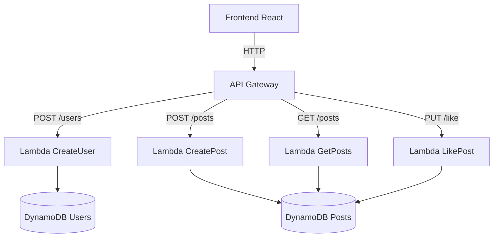

# SocialVite - Rede Social Simplificada

[](https://react.dev/)
[](https://aws.amazon.com/)

Uma rede social estilo Twitter/X desenvolvida com React + Vite no frontend e AWS Serverless no backend.

 <!-- Adicione uma screenshot depois -->

## ✨ Funcionalidades

- 🧑💻 Cadastro simplificado de usuários
- 📝 Criação de posts
- ❤️ Sistema de likes
- 🌐 Feed global compartilhado
- 📱 Design responsivo

## 🛠 Tecnologias

### **Frontend:**
- React 18
- Vite 4
- React Router 6
- CSS Modules

### **Backend:**
- AWS Lambda
- API Gateway
- DynamoDB
- AWS IAM

## 🚀 Como começar

### **Pré-requisitos**
- Node.js 18+
- Conta AWS configurada

### **Instalação**

1. Clone o repositório:
    ```bash
    git clone https://github.com/dayvisonmsilva/social-network.git
    cd socialvite/frontend
    ```

2. Instale as dependências:
    ```bash
    npm install
    ```

3. Configure as variáveis de ambiente (.env):
    ```plaintext
    VITE_API_URL=https://SEU_API_ID.execute-api.regiao.amazonaws.com/prod
    ```

4. Inicie a aplicação:
    ```bash
    npm run dev
    ```

## 🔧 Configuração AWS

1. **Criação de tabelas no DynamoDB:**
   - `SocialUsers` (Chave primária: `userId`)
   - `SocialPosts` (Chave primária: `postId`)

2. **Deploy das funções Lambda:**
   - `create-user` → `POST /users`
   - `create-post` → `POST /posts`
   - `get-posts` → `GET /posts`
   - `like-post` → `PUT /posts/{id}/like`

3. **Configuração do API Gateway:**
   - Criar recursos e métodos correspondentes
   - Ativar CORS para todas origens

## 🏗 Arquitetura



## 📌 Como Usar

### **Cadastro de Usuário:**
1. Insira um username na tela de login
2. Os dados são salvos no localStorage

### **Criar Postagem:**
1. Digite seu texto no campo "O que está acontecendo?"
2. Clique em "Publicar"

### **Interagir com Posts:**
1. Clique no ❤️ para curtir/descurtir
2. As atualizações são refletidas em tempo real

## 🚨 Solução de Problemas

### **Erro de permissão no AWS Learning Lab:**
```plaintext
AccessDeniedException: User not authorized to perform dynamodb:PutItem
```
✅ Verifique as permissões da role no IAM e garanta acesso ao DynamoDB.

### **Problema de CORS:**
✅ No API Gateway, habilite:
```plaintext
Access-Control-Allow-Origin: '*'
Access-Control-Allow-Methods: 'POST,GET,PUT'
```

## 🤝 Contribuindo

Contribuições são bem-vindas! Para contribuir:

1. Faça um fork do projeto
2. Crie uma branch (`git checkout -b feature/nova-feature`)
3. Faça commit das alterações (`git commit -m 'Adiciona nova feature'`)
4. Faça push para a branch (`git push origin feature/nova-feature`)
5. Abra um Pull Request

## 📄 Licença

Distribuído sob a licença MIT. Consulte `LICENSE` para mais informações.