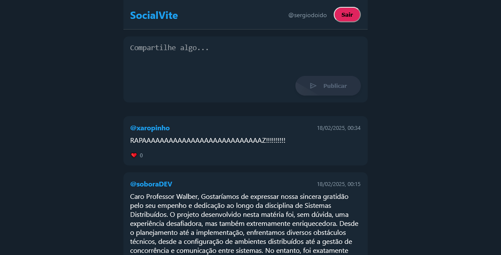

# SocialVite - Rede Social Simplificada

[](https://react.dev/)
[](https://aws.amazon.com/education/awseducate/)

Uma rede social estilo Twitter/X desenvolvida com React + Vite no frontend e AWS Serverless (Lambda, DynamoDB, API Gateway) no backend.

 <!-- Adicione uma screenshot depois -->

## ✨ Funcionalidades Principais

- 🧑💻 Cadastro simplificado de usuários
- 📝 Criação de posts públicos
- ❤️ Sistema de likes em tempo real
- 🌐 Feed global compartilhado
- 📱 Design responsivo para mobile

## 🛠 Tecnologias Utilizadas

**Frontend:**
- React 18
- Vite 4
- React Router 6
- CSS Modules

**Backend:**
- AWS Lambda
- API Gateway
- DynamoDB
- AWS IAM (Role Lab)

## 🚀 Começando

### Pré-requisitos
- Node.js 18+
- Conta AWS com acesso ao Learning Lab
- AWS CLI configurado (opcional)

### Instalação

1. Clone o repositório:
    ```
    bash
    git clone https://github.com/seu-usuario/socialvite.git
    cd socialvite/frontend
    ```

2. Instale as dependências:

    ```npm install```

3. Configure as variáveis de ambiente (crie um arquivo .env):

    ```VITE_API_URL=https://SEU_API_ID.execute-api.regiao.amazonaws.com/prod```

4. Inicie a aplicação:

    ```npm run dev```

# 🔧 Configuração AWS

    1. Crie as tabelas no DynamoDB:

        SocialUsers (Chave primária: userId)

        SocialPosts (Chave primária: postId)

    2. Implante as funções Lambda:

        create-user (POST /users)

        create-post (POST /posts)

        get-posts (GET /posts)

        like-post (PUT /posts/{id}/like)

    3. Configure o API Gateway:

        Crie recursos e métodos correspondentes

        Ative o CORS para todas origens

# 🧠 Arquitetura

 ```graph TD
    A[Frontend React] -->|HTTP| B[API Gateway]
    B -->|POST /users| C[Lambda CreateUser]
    B -->|POST /posts| D[Lambda CreatePost]
    B -->|GET /posts| E[Lambda GetPosts]
    B -->|PUT /like| F[Lambda LikePost]
    C --> G[(DynamoDB Users)]
    D --> H[(DynamoDB Posts)]
    E --> H
    F --> H 
```

# 💻 Como Usar

### Cadastro de Usuário:

        Insira um username na tela de login
        Os dados são salvos no localStorage

### Criar Postagem:

        Digite seu texto no campo "O que está acontecendo?"

        Clique em "Publicar"

### Interagir com Posts:

        Clique no ❤️ para curtir/descurtir

        As atualizações são refletidas em tempo real

# 🚨 Troubleshooting

### Erro comum no AWS Learning Lab:

``` AccessDeniedException: User not authorized to perform dynamodb:PutItem ```

    Verifique se a role lab tem permissões para DynamoDB

    Confira as políticas anexadas à role

### Problema de CORS:

    No API Gateway, habilite:

    Access-Control-Allow-Origin: '*'
    Access-Control-Allow-Methods: 'POST,GET,PUT'

# 🤝 Contribuindo

### Contribuições são bem-vindas! Siga estes passos:

1. Faça um fork do projeto

2. Crie uma branch (git checkout -b feature/nova-feature)

3. Faça commit das alterações (git commit -m 'Adiciona nova feature')

4. Faça push para a branch (git push origin feature/nova-feature)

5. Abra um Pull Request

# 📄 Licença

Distribuído sob a licença MIT. Veja LICENSE para mais informações.